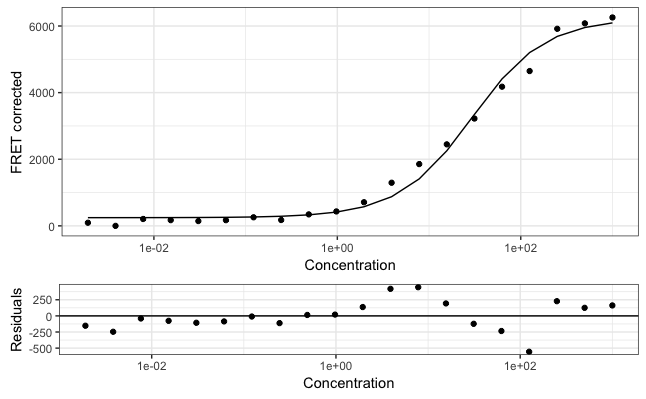

# No longer maintained

**I no longer have time to maintain this package. I won't add new functionality,
I won't fix bugs, I won't review or merge contributions. Use at your own risk,
fork if you want.**

Making this package taught me a lot. Most importantly, I realized that I tried
to make it too broad in scope. A more generic non-linear curve-fitting package
would still be a useful addition to the R package ecosystem (at the time of this
writing), but it ought to be a lot narrower in scope and hence a lot simpler in
design. I may work on this in the future if time allows.

# rfret: Analyze FRET Binding Data with R

[](https://travis-ci.org/Guilz/rfret)
[](https://codecov.io/gh/Guilz/rfret)


This R package allows you to analyze FRET binding data and produce this kind of
binding curve figure:



Given raw fluorescence data from a FRET binding experiment, you can:

1. plot all channels (donor, acceptor, FRET) to visually inspect raw data and
   find possible outliers;
2. average fluorescence values of technical replicates of a same experiment;
3. correct FRET signal by subtracting signal from a blank experiment;
4. guess initial values for the parameters of the binding model equation (`kd`,
   `signal_min`, `signal_max`);
5. fit a binding model equation to the data;
6. report the value of Kd;
7. plot the corrected FRET signal and the binding curve obtained by fitting
   the data.

This package allows batch processing and analysis of any number of datasets at
a time. It can also process and analyze fluorescence polarization or anisotropy
binding data. Support for fluorescence quenching data is also planned.

## Installation

First, install the `devtools` package, if not already present on your system:

```r
install.packages("devtools")
```

You can then install `rfret` from GitHub, right from within R:

```r
devtools::install_github("Guilz/rfret", build_vignettes = TRUE)
```

## Usage

You can access a detailed tutorial using the following commands:

```r
library(rfret)
vignette("analyzing_fret_data")
```
